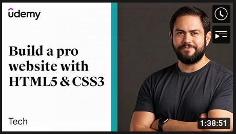
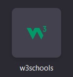

# musaz.com
Ntshapheka's web 
<!DOCTYPE html>
<html lang="en">

<head>
    <meta charset="UTF-8">
    <meta name="viewport" content="width=device-width">
    <title>Ntshapheka's Web</title>
    <link rel="stylesheet" href="styles.css">
</head>

<body>

    

        

            

                

                    <a href="index.html.">Home</a>
                

                

                    <a href="about.html">About</a>
                

            

            

                

                    
MUSA NTSHAPHEKA

                

            

        

        

            

                

                    

                    

                        

                            
                        

                        

                            Beyond Curiosity - - -
                            <a href="https://wordpress.com/home/musa.food.blog"> Musa's Food blog </a>

                        

                    

                

                

                    

                    

                        

                            
                        

                        

                            Musa Ntshapheka's
                            <a href="https://www.linkedin.com/in/musa-ntshapheka-8a0293142/details/certifications/">Linkedin Profile</a>

                        

                    

                

                

                    

                    

                        

                            
                        

                        

                            Musa's
                            <a href="https://twitter.com/MusaNtshapheka?s=09"> twitter handler </a>

                        

                    

                

                

                    

                    

                        

                            
                        

                        

                            Learn to be a
                            <a href="https://www.mygreatlearning.com/academy/career-paths/data-analyst"> data analyst </a>

                        

                    

                

                

                    

                    

                        

                            
                        

                        

                            Became a
                            <a href="https://www.udacity.com/blog/2021/01/becoming-a-full-stack-web-developer-what-you-need-to-know.html">Full Stack Web Developer</a>

                        

                    

                

                

                    

                    

                        

                            
                        

                        

                            Jordan Hudgen of Udemy
                            <a href="https://youtu.be/5bMdjkfvONE"> builds a pro web </a>

                        

                    

                

                

                    

                    

                        

                            
                        

                        

                            All Windows hidden features,
                            <a href="https://youtu.be/IbuKffs7wmg">by Thio Joe</a>

                        

                    

                

                

                    

                    

                        

                            
                        

                        

                            Microsoft Certified:
                            <a href="https://docs.microsoft.com/en-us/learn/certifications/">Azure Fundamentals</a>

                        

                    

                

                

                    

                    

                        

                            
                        

                        

                            Web Developer Interview
                            <a href="https://www.softwaretestinghelp.com/web-developer-interview-questions-and-answers/"> Q & A</a>

                        

                    

                

                

                    

                    

                        

                            
                        

                        

                            W3Schools is a free
                            <a href="https://www.w3schools.com/default.asp">web4 learning coding online.</a>
                        

                    

                

                

                    

                    

                        

                            
                        

                        

                            Learn JavaScript in 12 minutes
                            <a href="https://youtu.be/Ukg_U3CnJWI">by Jake Wright</a>
                        

                    

                

                

                    

                    

                        

                            
                        

                        

                            Alison IT
                            <a href="https://alison.com/courses/software-development">courses</a>

                        

                    

                

            

</body>

</html>
